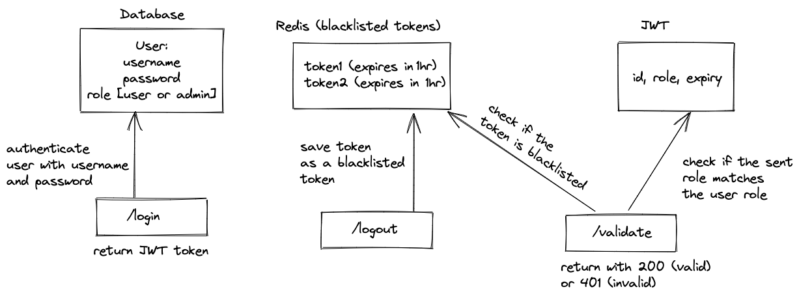

# User Authentication and Authorization

## Run:

To run the docker-compose.yaml file (production environment):
```bash
docker-compose up -d
```
To run the docker-compose.dev.yaml file (development environment):
```bash
docker compose -f "docker-compose.dev.yaml" up -d
```

To view logs:
```bash
docker-compose logs -f server
```

To run the migration:
```bash
npm run migrate
```

To test the login:
"User" account
Username: Romaine_Hettinger
Password: Test123

"Admin" account
Username: Amelia_Marks
Password: Test123

## Endpoints:



* /login : to authenticate the user using username and passwords. It generates a JWT token containing the user id, username and role.
* /logout : to log the user out of the system and stores the token in Redis as a blacklisted token.
* /validate : given a JWT token and a role, the API checks if the token is valid (not expired) and the given role matches the user's role, or if the token is blacklisted (user has already logged out)

## Postman Collection:
[postman-collection](./documentation/user-auth.postman_collection.json)